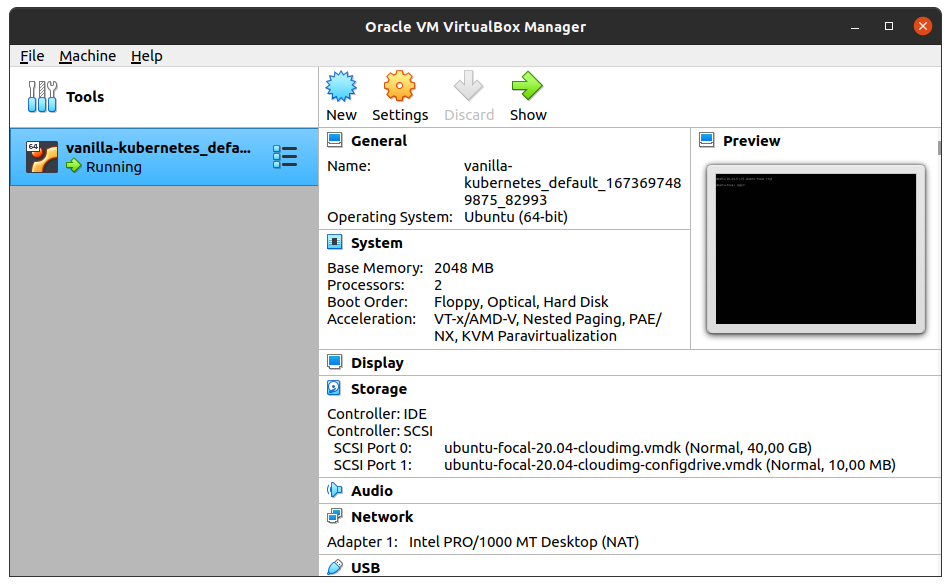
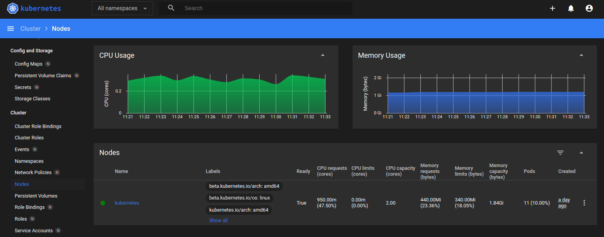

# Vanilla Kubernetes

Installing a multi-node Kubernetes cluster, by using:

- Vagrant
  - Ubuntu (operating system)
  - VirtualBox (hypervisor)

- Ansible
  - Docker (container runtime)
  - Kubeadm (installer)

There are alternatives, for each of the four components...

But this setup is a very common and tested combination.

Alternative setups:

- Minikube (uses machine)
- Microk8s (uses snap)

Those are more all-in-one solutions,and slightly opaque...

This method is transparent, although resource-intensive:

```console
vagrant up
```

Written by Anders Björklund @afbjorklund

May 08, 2023 (Kubernetes version v1.27)

Official method:

- [Kubespray](https://kubernetes.io/docs/setup/production-environment/tools/kubespray/) (HA cluster)

## Vagrant

You will need to install the `vagrant` tool, in order to run the `Vagrantfile`:

```ruby
Vagrant.configure("2") do |config|
  ...
end
```

<https://vagrantup.com>

### Ubuntu

The virtual machine is packed into a .box, for each provider (such as VirtualBox):

```ruby
  config.vm.box = "ubuntu/focal64"
  config.vm.box_check_update = true
```

### VirtualBox

Kubernetes wants more resources from VirtualBox, than the default VM allocation:

> - 2 GB or more of RAM per machine (any less will leave little room for your apps)
> - 2 CPUs or more

```ruby
  config.vm.provider "virtualbox" do |vb|
    vb.memory = "2048"
    vb.cpus = 2
  end
```

Ansible provisioning requires ssh access with sudo, and that python is installed:

```ruby
  config.vm.provision "shell", inline: <<-SHELL
    apt-get update
    apt-get install -y python python-apt
  SHELL
  config.vm.provision "ansible" do |ansible|
    ansible.playbook = "ansible/playbook.yml"
    ansible.verbose = false
  end
```

## Ansible

You will need to install `ansible-playbook`, in order to run the `playbook.yaml`:

```yaml
- hosts: all
  become: yes
  roles:
    - docker
    - kubeadm
```

<https://ansible.com>

### Docker

See: <https://docs.docker.com/install/linux/docker-ce/ubuntu/>

[ansible/roles/docker/tasks/main.yml](ansible/roles/docker/tasks/main.yml)

Packages:

- docker-ce
- docker-ce-cli
- containerd\.io

### Requirements

Since Kubernetes version 1.24, it is now **required** to install and configure CRI and CNI:

- cri-tools (<https://github.com/kubernetes-sigs/cri-tools>)
  `/etc/crictl.yaml`
- kubernetes-cni (<https://github.com/containernetworking/plugins>)
  `/etc/cni/net.d`

The default container runtime is containerd, to use docker additional setup is needed:

- cri-dockerd (<https://github.com/Mirantis/cri-dockerd>)
  `cri-docker.service`

### Kubeadm

See: <https://kubernetes.io/docs/setup/production-environment/tools/kubeadm/install-kubeadm/>

[ansible/roles/kubeadm/tasks/main.yml](ansible/roles/kubeadm/tasks/main.yml)

Packages:

- kubeadm
- kubelet
- kubectl

### Config

The default kubeadm config doesn't work with docker, only containerd:

```
Found multiple CRI endpoints on the host. Please define which one do you wish
to use by setting the 'criSocket' field in the kubeadm configuration file:
unix:///var/run/containerd/containerd.sock, unix:///var/run/cri-dockerd.sock
```

Using kubeadm now requires a YAML file, instead of the previous flags:

```console
$ vagrant ssh
...
vagrant@kubernetes:~$ sudo kubeadm init --config kubeadm-config.yaml
```

```yaml
apiVersion: kubeadm.k8s.io/v1beta3
kind: InitConfiguration
nodeRegistration:
  criSocket: unix:///var/run/cri-dockerd.sock
```
`kubeadm config print init-defaults`

```console
$ vagrant ssh
...
vagrant@kubernetes:~$ sudo kubeadm join --config kubeadm-config.yaml ...
```

```yaml
apiVersion: kubeadm.k8s.io/v1beta3
kind: JoinConfiguration
nodeRegistration:
  criSocket: unix:///var/run/cri-dockerd.sock
```

`kubeadm config print join-defaults`

## Access

To set up access with the regular `ssh` client, use `vagrant ssh-config`:

```console
$ vagrant ssh-config >>~/.ssh/config
```

Then you can just use the name of the node, for _any_ command using ssh:

```console
$ ssh default
```

One ssh example would be to tunnel the port of the dashboard (see below):

```console
$ ssh default -L 8001:127.0.0.1:8001 -N &
```

To tunnel the apiserver, it needs `--apiserver-cert-extra-sans=127.0.0.1`:

```console
$ ssh default -L 6443:127.0.0.1:6443 -N &
```

`Unable to connect to the server: x509: certificate is valid for 10.96.0.1, 10.0.2.15, not 127.0.0.1`

```yaml
apiVersion: kubeadm.k8s.io/v1beta3
kind: ClusterConfiguration
apiServer:
  certSANs:
    - "127.0.0.1"
```

### Docker

Locally on node:

`ssh default docker version`

Remotely from host:

`DOCKER_HOST=ssh://default docker version`

### Rootless

`sudo apt install -y uidmap`

`echo "$(whoami):100000:65536" | sudo tee -a /etc/subuid`

`dockerd-rootless-setuptool.sh install --force`

`docker context use default`

See: <https://docs.docker.com/engine/security/rootless/>

Now there are _two_ different daemons:

#### System

`docker --context=default info`

`DOCKER_HOST=unix://var/run/docker.sock`

```shell
vagrant@kubernetes:~$ systemctl status --system docker
● docker.service - Docker Application Container Engine
...
```

#### User

`docker --context=rootless info`

`DOCKER_HOST=unix://$XDG_RUNTIME_DIR/docker.sock`

```shell
vagrant@kubernetes:~$ systemctl status --user docker
● docker.service - Docker Application Container Engine (Rootless)
...
```

To access rootless docker over ssh, edit `~/.bashrc`:

```diff
@@ -2,6 +2,9 @@
 # see /usr/share/doc/bash/examples/startup-files (in the package bash-doc)
 # for examples
 
+DOCKER_HOST=unix://$XDG_RUNTIME_DIR/docker.sock
+
 # If not running interactively, don't do anything
 case $- in
     *i*) ;;
```

To build images rootless, and load them in cluster:

`docker --context=rootless build -t myimage`

`docker --context=rootless save myimage | docker --context=default load`

## Cluster

Now that machines have been prepared, it is time to install Kubernetes.

You need one master, and one or more nodes (formerly known as minions).

Master:

```shell
kubeadm init [--pod-network-cidr=10.244.0.0/16]
```

<https://kubernetes.io/docs/reference/setup-tools/kubeadm/kubeadm-init/>

Note: the change of subnet CIDR is only needed for "flannel" (see below)

```yaml
apiVersion: kubeadm.k8s.io/v1beta3
kind: ClusterConfiguration
networking:
  podSubnet: "10.244.0.0/16"
```

To see the token again: `kubeadm token create --print-join-command`

Minion:

```shell
kubeadm join master:6443 --token ... --discovery-token-ca-cert-hash ...
```

<https://kubernetes.io/docs/reference/setup-tools/kubeadm/kubeadm-join/>

### Single-node

If you only have room for a single machine, you run pods on the master:

```shell
kubectl taint nodes --all node-role.kubernetes.io/control-plane:NoSchedule-
```

In a real production environment, you would have multiple masters (HA).

See: <https://kubernetes.io/docs/setup/production-environment/tools/kubeadm/high-availability/>

### Network

A cluster network needs to be deployed as well, two popular choices are:

- Flannel

- Calico

These are normally deployed as resources, by using a `kubectl` command.

See: <https://kubernetes.io/docs/setup/production-environment/tools/kubeadm/create-cluster-kubeadm/#pod-network>

### Images

As per Kubernetes v1.27.0, here is the list of container images used:

```shell
kubeadm config images list
```

```text
registry.k8s.io/kube-apiserver:v1.27.0
registry.k8s.io/kube-controller-manager:v1.27.0
registry.k8s.io/kube-scheduler:v1.27.0
registry.k8s.io/kube-proxy:v1.27.0
registry.k8s.io/pause:3.9
registry.k8s.io/etcd:3.5.7-0
registry.k8s.io/coredns/coredns:v1.10.1
```

They total a download size of 200 MiB, in their default compressed form.

To download all the kubernetes images to the current container runtime:

```shell
kubeadm config images pull
```

Use `docker save` to save all images in a tar archive, for `docker load`.

Optionally use `pigz` or `pixz`, to compress the contents of the .tar file.

```text
Loaded image: registry.k8s.io/kube-apiserver:v1.27.0
Loaded image: registry.k8s.io/kube-controller-manager:v1.27.0
Loaded image: registry.k8s.io/kube-scheduler:v1.27.0
Loaded image: registry.k8s.io/kube-proxy:v1.27.0
Loaded image: registry.k8s.io/pause:3.9
Loaded image: registry.k8s.io/etcd:3.5.7-0
Loaded image: registry.k8s.io/coredns/coredns:v1.10.1
```

### Flannel

> Flannel is a way to configure a layer 3 network fabric designed for Kubernetes.

<https://github.com/flannel-io/flannel>

```shell
rm -f /etc/cni/net.d/*.conf*  # remove any existing CNI configuration, "there can be only one" </highlander>
kubectl apply -f https://raw.githubusercontent.com/flannel-io/flannel/v0.21.2/Documentation/kube-flannel.yml
```

```text
docker.io/flannelcni/flannel:v0.21.2
docker.io/flannelcni/flannel-cni-plugin:v1.1.0
```

### Storage

> nfs-server-provisioner is an out-of-tree dynamic provisioner for Kubernetes.

<https://github.com/kubernetes-sigs/nfs-ganesha-server-and-external-provisioner>

```shell
kubectl apply -f https://raw.githubusercontent.com/kubernetes-sigs/nfs-ganesha-server-and-external-provisioner/nfs-server-provisioner-1.4.0/deploy/kubernetes/rbac.yaml
kubectl apply -f https://raw.githubusercontent.com/kubernetes-sigs/nfs-ganesha-server-and-external-provisioner/nfs-server-provisioner-1.4.0/deploy/kubernetes/deployment.yaml
kubectl apply -f https://raw.githubusercontent.com/kubernetes-sigs/nfs-ganesha-server-and-external-provisioner/nfs-server-provisioner-1.4.0/deploy/kubernetes/class.yaml
```

```text
k8s.gcr.io/sig-storage/nfs-provisioner:v3.0.0
```

You can set it (nfs-server-provisioner) to be the cluster default storage class:

```shell
kubectl patch storageclass example-nfs -p '{"metadata": {"annotations":{"storageclass.kubernetes.io/is-default-class":"true"}}}'
```

Note: the **node** needs to have support for the `nfsv4` kernel module and nfs-client:

```
MountVolume.SetUp failed for volume "pvc-..." : mount failed: exit status 32 [...]
Output: mount: /var/lib/kubelet/pods/.../volumes/kubernetes.io~nfs/pvc-...: bad option;
for several filesystems (e.g. nfs, cifs) you might need a /sbin/mount.<type> helper program.
```

`sudo apt install nfs-common`

### Dashboard

> Kubernetes Dashboard is a general purpose, web-based UI for Kubernetes clusters.

<https://github.com/kubernetes/dashboard>

```shell
kubectl apply -f https://raw.githubusercontent.com/kubernetes/dashboard/v2.7.0/aio/deploy/recommended.yaml
```

```text
docker.io/kubernetesui/dashboard:v2.7.0
docker.io/kubernetesui/metrics-scraper:v1.0.8
```

Note: to be able to _access_ the dashboard you need to create a user, token and proxy:

`kubectl proxy`

<http://localhost:8001/api/v1/namespaces/kubernetes-dashboard/services/https:kubernetes-dashboard:/proxy/>

<https://github.com/kubernetes/dashboard/blob/master/docs/user/access-control/creating-sample-user.md>

### Metrics Server

> Metrics Server collects resource metrics and exposes them in Kubernetes apiserver.

<https://github.com/kubernetes-sigs/metrics-server>

```shell
kubectl apply -f https://github.com/kubernetes-sigs/metrics-server/releases/download/v0.6.2/components.yaml
```

```text
k8s.gcr.io/metrics-server/metrics-server:v0.6.3
```

Note: there is a bug in that the server name is not included in the https certificate.

The easiest workaround is editing the metrics-server Deployment, to allow the access:

`kubectl edit deployment -n kube-system metrics-server`

```diff
@@ -129,6 +129,7 @@
     spec:
       containers:
       - args:
+        - --kubelet-insecure-tls
         - --cert-dir=/tmp
         - --secure-port=443
         - --kubelet-preferred-address-types=InternalIP,ExternalIP,Hostname
```

`kubectl top node`

`kubectl top pod -A`

## Screenshots





## References

Sep 14, 2020 (Kubernetes version v1.19)
<https://itnext.io/kubernetes-production-cluster-with-vagrant-and-virtualbox-on-mac-8718586f179f>

March 15, 2019 (Kubernetes version v1.13)
<https://kubernetes.io/blog/2019/03/15/kubernetes-setup-using-ansible-and-vagrant/>

Apr 2, 2018 (Kubernetes version v1.9)
<https://medium.com/@lizrice/kubernetes-in-vagrant-with-kubeadm-21979ded6c63>
